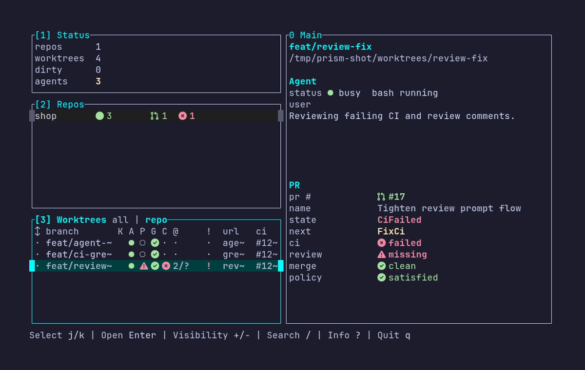

# Prism

```text
░▒▓█▓▒░ P ◤◥◣◢◤◥◣
▒▓█▓▒░▒ R ◥◣◢◤◥◣◢
▓█▓▒░▒▓ I ◣◢◤◥◣◢◤
█▓▒░▒▓█ S ◢◤◥◣◢◤◥
▓▒░▒▓█▓ M ◤◥◣◢◤◥◣
```

Prism is a meta-harness for managing agents in parallel on separate worktrees with tmux. It integrates with github (or other remote), so your hands don't need to leave the keyboard to view PR/CI status to merge.

## Overview



## What it enables

It's a local dashboard to manage code change lifecycles. From planning, implementation, PR, CI checks, CR comments and fixes. We have a centralized location to do all this in parallel for any number of changes at the same time.

- Keep each task in its own Git worktree and tmux-backed agent session.
- See repository, worktree, pull request, CI, and agent state in one TUI.
- Kick off repeatable agent flows for implementation, review repair, CI repair, and merge readiness.

## Prerequisites

Build/install requirements:

- Rust/Cargo

Normal runtime requirements:

- `git`
- GitHub CLI (`gh`)
- `tmux`
- WorkTrunk (`wt`)
- `opencode`
- `fzf`

## Install

```sh
./install.sh
```

## Start

```sh
prism
```

## Learn More

- [Keybindings](docs/keybindings.md)
- [Configuration](docs/config.md)
- [Auto Flow](docs/auto-flow.md)
- [Development](docs/development.md)
