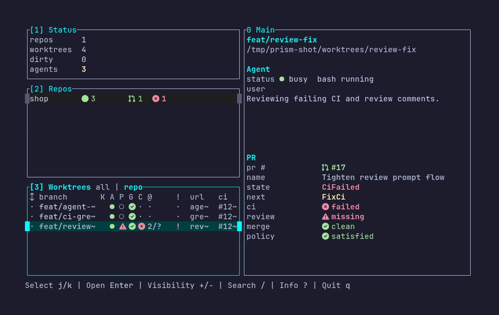

# Prism

```text
░▒▓█▓▒░ P ◤◥◣◢◤◥◣
▒▓█▓▒░▒ R ◥◣◢◤◥◣◢
▓█▓▒░▒▓ I ◣◢◤◥◣◢◤
█▓▒░▒▓█ S ◢◤◥◣◢◤◥
▓▒░▒▓█▓ M ◤◥◣◢◤◥◣
```

Prism is a meta-harness for managing agents in parallel on separate worktrees
with tmux. Its provider-neutral change-request workflows integrate with GitHub,
GitLab, Forgejo, and Codeberg, so you don't need to switch between worktrees,
terminals, browsers, or repositories.

## Overview



## What it enables

It's a local dashboard for code-change lifecycles: planning, implementation,
change-request creation, CI checks, and review fixes. It keeps parallel work in
one place.

- Isolate tasks with git worktrees and tmux sessions
- See repository, worktree, change-request, CI, and agent state in one TUI.
- Kick off repeatable agent flows for implementing a plan or fixing review, CI,
  and merge issues.

## Prerequisites

Core runtime requirements:

- `git`
- `tmux`
- WorkTrunk (`wt`)

Install the transport required by each repository:

- GitHub CLI (`gh`) for GitHub
- GitLab CLI (`glab`) for GitLab
- No provider CLI for Forgejo or Codeberg; configure the name of a token
  environment variable when private or mutating access is needed

GitHub.com, GitLab.com, and Codeberg are recognized automatically. Self-hosted
servers require an explicit mapping. See [Remote Hosting](docs/remote-hosting.md)
for authentication, supported server versions, capabilities, and diagnostics.

Agent harnesses are optional individually. Install and select whichever harness you want Prism to manage:

- OpenCode (`opencode`)
- Codex CLI (`codex`)
- Claude Code (`claude`)
- Pi (`pi`)
- Any other interactive command configured as a generic harness

Optional integrations:

- `fzf` for interactive plan selection
- `lazygit` for the tmux Git window

On first interactive startup, Prism lists the installed built-in harnesses and saves your selection to `~/.config/prism/config.toml`. OpenCode remains the fallback for non-interactive startup when no harness is configured. To use a generic command, configure it from the `H` chooser; see [Configuration](docs/config.md#harnesses).

## Install

Prism provides prebuilt archives for:

- Linux x86_64 with glibc 2.35 or newer (for example, Ubuntu 22.04)
- macOS x86_64 (Intel)
- macOS aarch64 (Apple Silicon)

Download the archive for your platform from the
[latest GitHub Release](https://github.com/NathanaelRea/prism/releases/latest),
verify it against the matching `.sha256` file, extract it, and place `prism`
somewhere on your `PATH`, such as `~/.local/bin`.

To build from source, install Rust 1.95 or newer, clone this repository, check
out the desired release tag, and run:

```sh
./install.sh
```

This installs a copy to `~/.local/bin/prism`. Set `PRISM_INSTALL_DIR` to choose
another directory.

## Start

```sh
prism
```

## Learn More

- [Keybindings](docs/keybindings.md)
- [Configuration](docs/config.md)
- [Remote Hosting](docs/remote-hosting.md)
- [Auto Flow](docs/auto-flow.md)
- [Development](docs/development.md)
